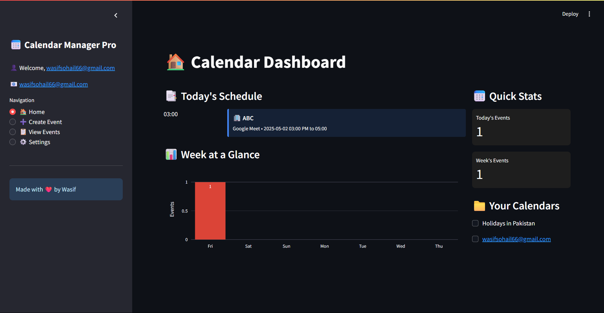
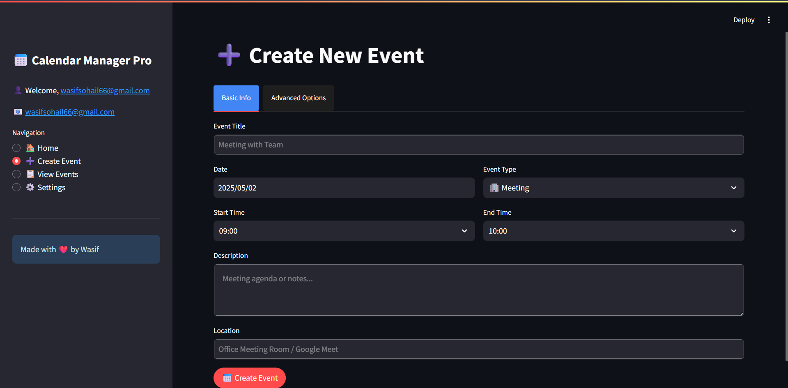
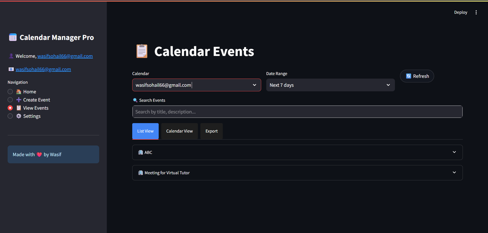
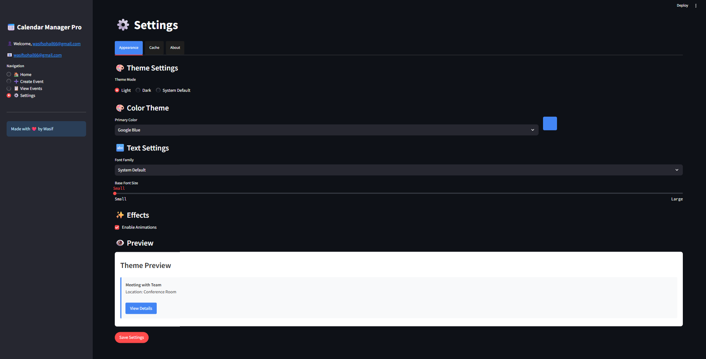

# 📅 Event Planner

<p align="center">
  <em>A feature-rich Google Calendar management application built with Streamlit</em>
</p>

<p align="center">
  <a href="#features">Features</a> •
  <a href="#installation">Installation</a> •
  <a href="#usage">Usage</a> •
  <a href="#screenshots">Screenshots</a> •
  <a href="#configuration">Configuration</a> •
  <a href="#contributing">Contributing</a> •
  <a href="#license">License</a>
</p>

<p align="center">
  
  
  
  
</p>

## 🌟 Overview

Event Planner is a powerful, intuitive application that brings the full potential of Google Calendar into a beautiful, customizable Streamlit interface. Managing your schedule has never been easier or more visually appealing.

## ✨ Features

- **🔒 One-Time Authentication** - Sign in once, token stored securely for future use
- **🎨 Customizable UI** - Choose from light/dark modes and multiple color themes
- **📊 Dashboard View** - See your daily agenda and weekly event distribution
- **➕ Enhanced Event Creation**
  - 🔄 Recurring events with intuitive patterns
  - 👥 Add attendees easily
  - 🔔 Customize reminders (email/popup)
- **🔍 Advanced Event Search & Filtering** - Find events by keyword, date range, and more
- **⚠️ Conflict Detection** - Automatically detects scheduling conflicts
- **🌍 Time Zone Management** - Automatic detection and conversion
- **💾 Offline Access** - View cached events even without internet
- **📤 Export Options** - Download your events in JSON or CSV format
- **📱 Responsive Design** - Works on desktop, tablet, and mobile

## 📸 Screenshots

<table>
  <tr>
    <td></td>
    <td></td>
  </tr>
  <tr>
    <td></td>
    <td></td>
  </tr>
</table>

## 🛠️ Installation

### Prerequisites
- Python 3.7 or higher
- A Google account
- Google Calendar API credentials

### Step 1: Clone this repository
```bash
git clone https://github.com/Wasif-Sohail55/Event-Planner.git
cd Event-Planner
```

### Step 2: Create a virtual environment (optional but recommended)
```bash
python -m venv venv
source venv/bin/activate  # On Windows: venv\Scripts\activate
```

### Step 3: Install dependencies
```bash
pip install -r requirements.txt
```

### Step 4: Set up Google Calendar API
1. Go to the [Google Cloud Console](https://console.cloud.google.com/)
2. Create a new project
3. Enable the Google Calendar API
4. Create OAuth 2.0 credentials (Desktop application)
5. Download the credentials JSON file
6. Place the file in the `auth/` folder as `credentials.json`

## 🚀 Usage

### Starting the app
```bash
streamlit run main.py
```

The first time you run the app, it will open a browser window asking you to authorize the application to access your Google Calendar. After granting permission, your authentication token will be saved, and you won't need to sign in again.

### Using the app
- **Home**: View today's events and weekly schedule
- **Create Event**: Add new events to your calendar
- **View Events**: Browse, search, and manage existing events
- **Settings**: Customize the app's appearance and behavior

## ⚙️ Configuration

You can customize various aspects of the app through the Settings page:

- **Theme**: Choose between light mode, dark mode, or system default
- **Colors**: Select from 7 color schemes (Google Blue, Red, Yellow, Green, Purple, Pink, Teal)
- **Font**: Change font family and size
- **Cache**: Manage event caching for faster load times and offline use

## 🤝 Contributing

Contributions are welcome! Feel free to:

1. Fork this repository
2. Create a feature branch (`git checkout -b feature/amazing-feature`)
3. Commit your changes (`git commit -m 'Add amazing feature'`)
4. Push to the branch (`git push origin feature/amazing-feature`)
5. Open a Pull Request

Please make sure to follow our coding standards and keep the app modular and maintainable.

## 📝 License

This project is licensed under the MIT License - see the [LICENSE](LICENSE) file for details.

## 👏 Acknowledgments

- Built with [Streamlit](https://streamlit.io/)
- Powered by [Google Calendar API](https://developers.google.com/calendar)
- Created by [Wasif Sohail](https://github.com/Wasif-Sohail5) (May 2025)

---

<p align="center">
  Made with ❤️ in Pakistan
  <br>
  <em>Last updated: May 2, 2025</em>
</p>
